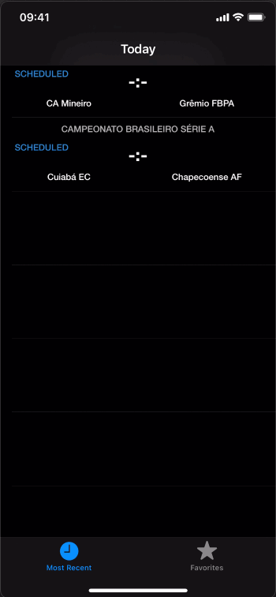
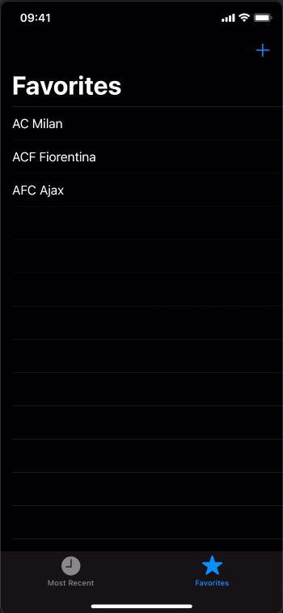

# Football Live - The Football-Data Api
An iOS app that gets football information from the Football-data api (https://www.football-data.org)

## How to Use 

**Step 1:**

Download or clone this repo by using the link below:

```
https://github.com/binemugha/Football-App-iOS.git
```

**Step 2:**

Run the project on the Xcode with play button or press CMD + R on your keyboard: 

```
CMD + R 
```

##  App features
- User can see the latest scheduled, and live fixtures of the day.
- User can view team details by tapping on the teams.
- User can add a team as their favorite team and gets stored using Core Data


## Up-coming features
- Pull down to refresh.
- Error message due to poor or no network


## Walkthrough






## Helpers
GIF created with [LiceCap](http://www.cockos.com/licecap/).
Icons are from [Materialdesignicons](https://materialdesignicons.com/).

